# QuizMaster

QuizMaster is a simple, mordern and interactive application designed to test knowledge with fun quizzes. Users can answer multiple-choice questions, track their scores, and improve their learning in an engaging way. It’s lightweight, easy to use, and a great project for exploring concepts like state management, UI design, and dynamic data handling.

## Features

- Two Modes: Switch between Study Mode (flip cards) and Quiz Mode (take quizzes).
- Interactive Flashcards: Simple and clean UI to view and flip cards.
- Score Tracking: Evaluate performance in quiz mode.
- Fast & Responsive: Built with Next.js for a smooth and responsive experience.
- Modern UI: Clean design with Tailwind CSS (optional if you’re using it).

## Installation

Clone the repository and install dependencies


1. Clone the repo:

```bash
git clone https://github.com/himathace/quiz.git
cd quiz
```

2. Install dependencies:

```bash
npm install
```

3. Run the development server:

```bash
npm run dev
```


4. add Environment Variables


- Create a .env file in the server folder based on .env.example.

```bash
MONGO_URI=your_mongodb_connection_string
```

5. Open http://localhost:3000
 in your browser to see the app.


## Screenshots

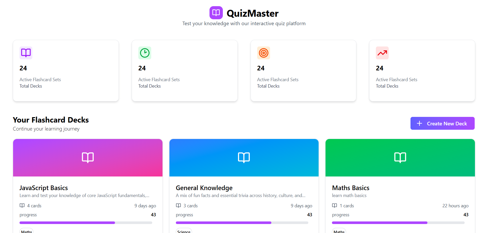
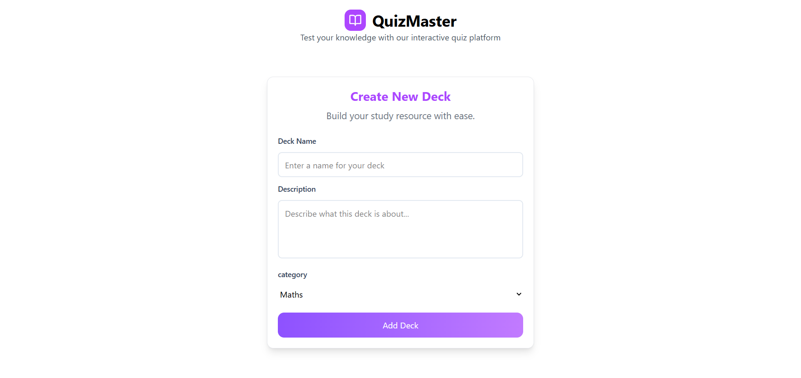
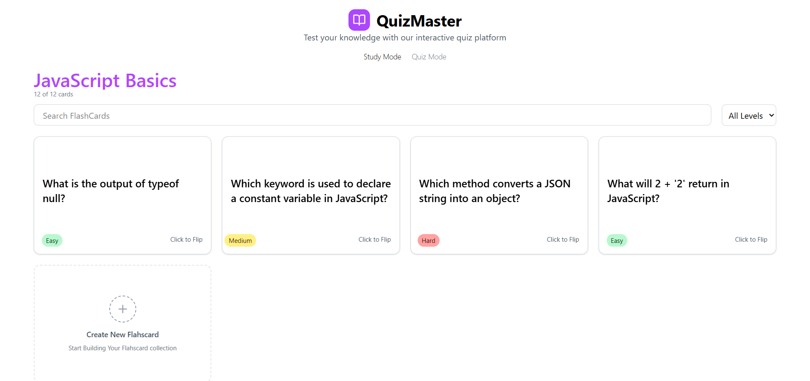
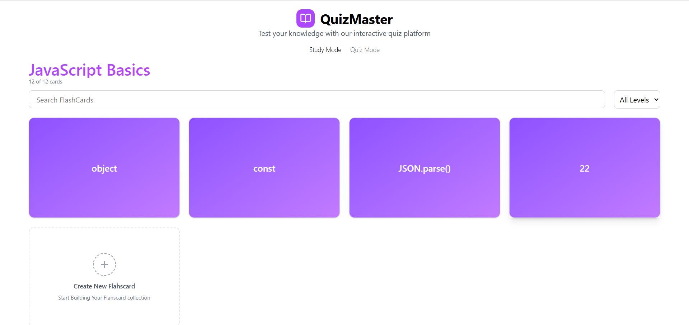
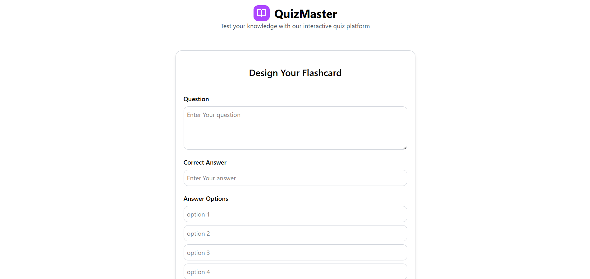
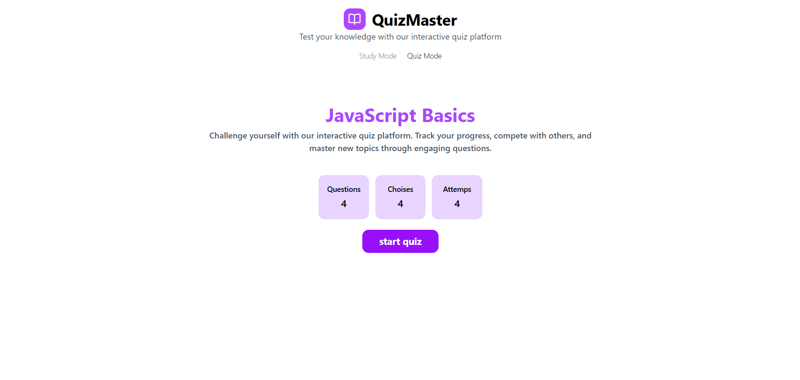
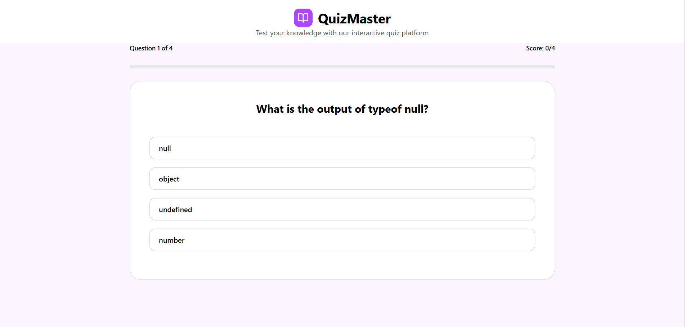
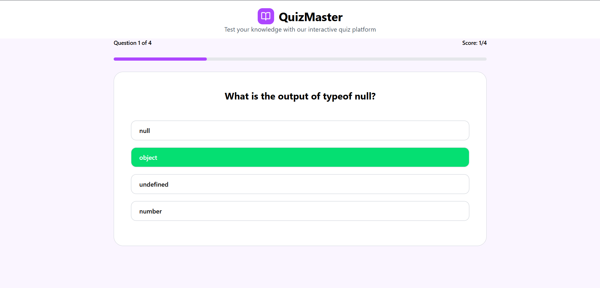
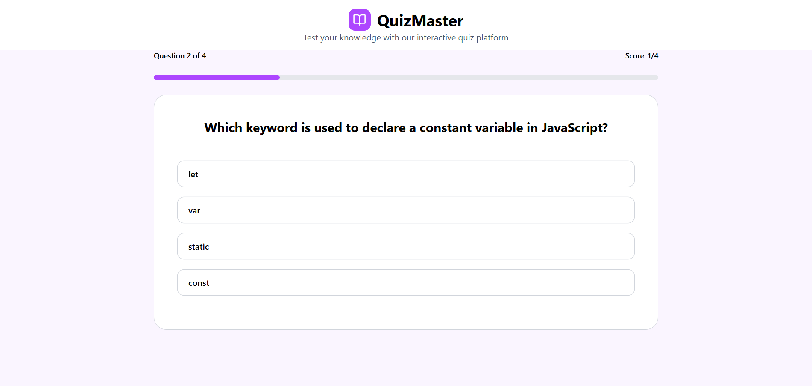
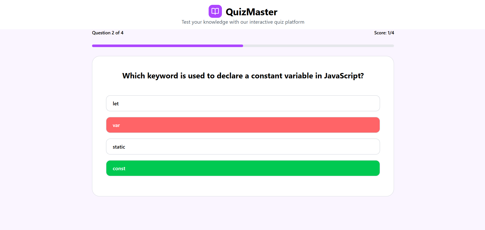
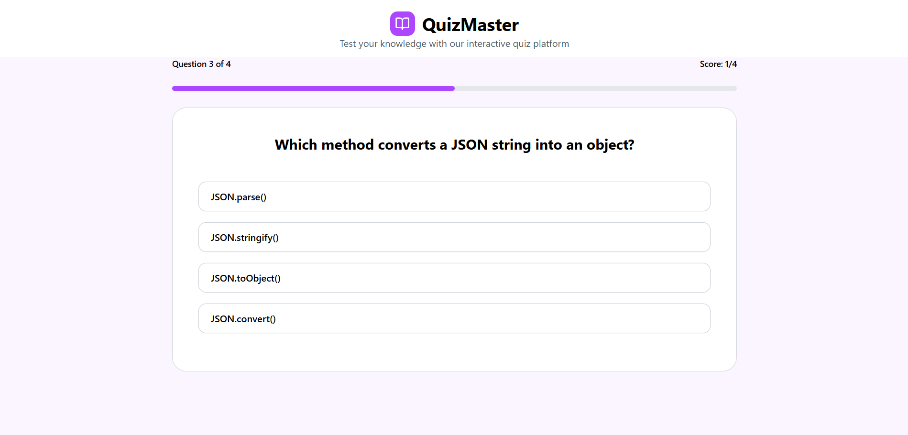
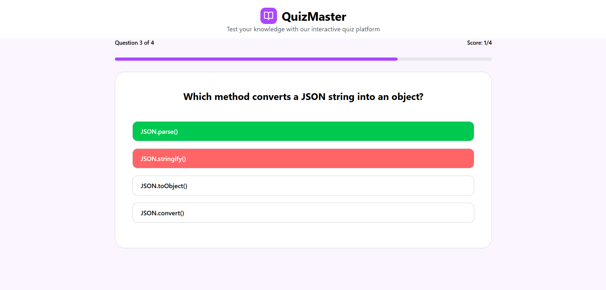
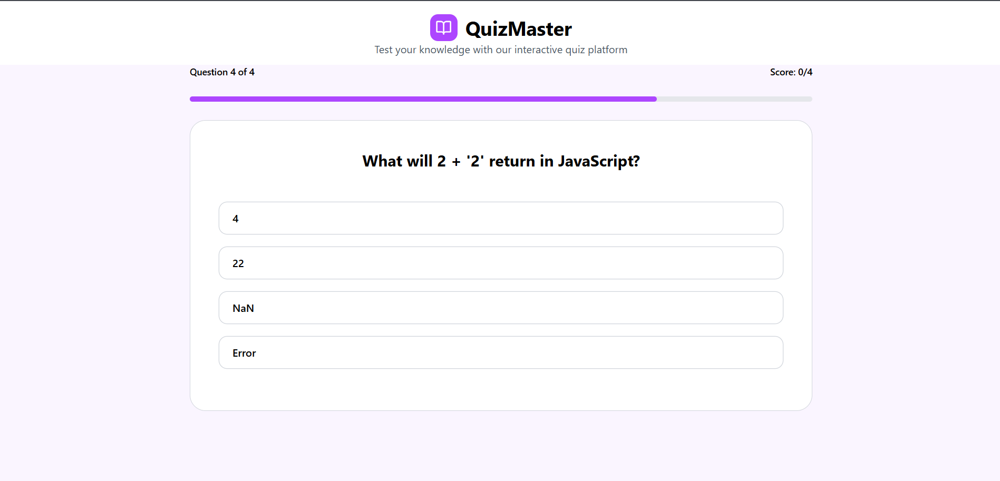

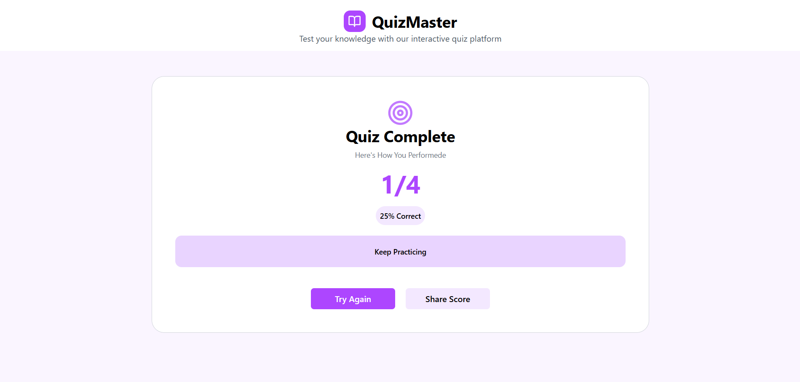


## Tech Stack

- Frontend Framework: Next.js
- Styling: Tailwind CSS
- State Management: React Hooks / Context API
- Deployment: Vercel


## Contributing

Contributions are welcome! Please open an issue first to discuss what you’d like to change.

Steps:
1. Fork the repository
2. Create your feature branch: `git checkout -b feature/YourFeature`
3. Commit your changes: `git commit -m 'Add your message'`
4. Push to the branch: `git push origin feature/YourFeature`
5. Open a pull request

## Author

- Himath Dewmika– [@himathace](https://github.com/himathace)


